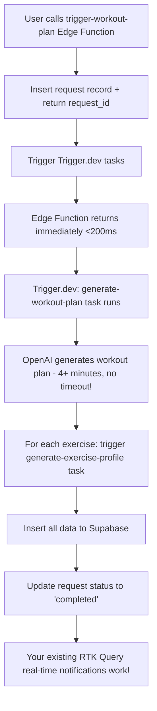

# Trigger.dev + Supabase Workout Plan Generation Integration Guide

## Overview

This system solves the OpenAI timeout issue by moving long-running workout plan generation (4+ minutes) from Supabase Edge Functions to Trigger.dev background tasks. Your existing real-time notification system remains unchanged.

## Architecture



## Components

### 1. Trigger.dev Tasks
- **`generate-workout-plan`** - Main orchestration task (handles 4+ minute OpenAI calls)
- **`generate-exercise-profile`** - Creates exercise profiles in database

### 2. Supabase Edge Function
- **`trigger-workout-plan`** - Lightweight function that just triggers Trigger.dev tasks

### 3. Database Tables (Unchanged)
- `workout_plan_requests` - Request tracking for real-time updates
- `workout_plans` - Generated workout plans
- `workout_entries` - 8 weeks of workout data
- `exercises` - Exercise profiles with instructions

## Usage

### Call the New Edge Function

Instead of calling `generate-workout-plan`, call the new `trigger-workout-plan` function:

```typescript
// OLD (timeout issues)
const response = await fetch(`${SUPABASE_URL}/functions/v1/generate-workout-plan`, {
  method: 'POST',
  headers: {
    'Authorization': `Bearer ${session.access_token}`,
    'Content-Type': 'application/json',
  },
  body: JSON.stringify({
    userProfile: "I want to build muscle, 3x per week...",
    systemPrompt: "Your workout system prompt here"
  })
});

// NEW (no timeout issues)
const response = await fetch(`${SUPABASE_URL}/functions/v1/trigger-workout-plan`, {
  method: 'POST',
  headers: {
    'Authorization': `Bearer ${session.access_token}`,
    'Content-Type': 'application/json',
  },
  body: JSON.stringify({
    userProfile: "I want to build muscle, 3x per week...",
    systemPrompt: "Your workout system prompt here" // Optional - will use default if not provided
  })
});
```

### Response Format (Unchanged)

```json
{
  "request_id": "uuid-here",
  "status": "processing",
  "message": "Workout plan generation started. You will be notified when complete."
}
```

### Real-time Monitoring (Unchanged)

Your existing RTK Query + Supabase Realtime setup works exactly the same:

```typescript
// This code remains unchanged
const { data: requestsData } = useGetWorkoutPlanRequestsQuery({ userId });
const requests = requestsData?.workout_plan_requestsCollection?.edges?.map(edge => edge.node) || [];
const currentRequest = requests.find(r => r.request_id === requestId);

// Status updates: 'processing' -> 'completed' | 'failed'
// Your real-time subscriptions fire automatically when Trigger.dev updates the status
```

## Key Benefits

✅ **No Timeout Issues** - 4+ minute OpenAI calls run without limits
✅ **Same API** - Change only the endpoint URL
✅ **Real-time Works** - Your existing notification system unchanged
✅ **Cost Effective** - ~$0.005 per workout plan generation
✅ **Error Handling** - Comprehensive error tracking and status updates
✅ **Parallel Processing** - Exercise profiles generated efficiently

## Implementation Checklist

### ✅ Completed Setup
- [x] Trigger.dev tasks created and deployed
- [x] Supabase Edge Function `trigger-workout-plan` deployed
- [x] Environment variables configured in Trigger.dev
- [x] Database schema matches task expectations
- [x] Exercise profile generation working

### 🔧 Update Your Client Code

1. **Change the endpoint URL** in your service layer:
   ```typescript
   // Change this line:
   const url = `${SUPABASE_URL}/functions/v1/generate-workout-plan`
   // To this:
   const url = `${SUPABASE_URL}/functions/v1/trigger-workout-plan`
   ```

2. **No other changes needed** - request/response format is identical

### 📊 Monitoring & Debugging

#### Trigger.dev Dashboard
- Monitor task execution: https://cloud.trigger.dev
- View logs, errors, and performance metrics
- Track individual task runs and their status

#### Supabase Logs
- Edge Function logs: Check `trigger-workout-plan` function logs
- Database queries: Monitor `workout_plan_requests` table updates

#### Common Issues

**Task Not Starting:**
- Check Trigger.dev environment variables are set
- Verify API keys are correct
- Check Supabase function logs for trigger errors

**Exercise Profile Errors:**
- Verify `exercises` table schema matches task expectations
- Check OpenAI API key and quota
- Review exercise profile generation logs in Trigger.dev

**Real-time Not Working:**
- Ensure `workout_plan_requests` table has proper RLS policies
- Check RTK Query subscriptions are still active
- Verify Supabase Realtime is enabled for the table

## Testing

### Local Development
```bash
# Test the trigger function locally
curl -X POST http://localhost:54321/functions/v1/trigger-workout-plan \
  -H "Authorization: Bearer YOUR_TOKEN" \
  -H "Content-Type: application/json" \
  -d '{
    "userProfile": "Test user profile",
    "systemPrompt": "Test system prompt"
  }'
```

### Production Testing
1. Call the `trigger-workout-plan` endpoint
2. Monitor Trigger.dev dashboard for task execution
3. Check database for `workout_plan_requests` status updates
4. Verify real-time notifications fire when status changes

## Cost Analysis

**Per Workout Plan Generation:**
- Trigger.dev compute: ~300 seconds × $0.0000169 = ~$0.005
- OpenAI API: ~$0.10-0.20 (depending on tokens)
- **Total: ~$0.11 per workout plan**

**Monthly Estimates:**
- 100 workout plans: ~$11
- 1000 workout plans: ~$110
- 10,000 workout plans: ~$1,100

## Migration Summary

**What Changed:**
- Long-running OpenAI calls moved to Trigger.dev (no timeouts)
- New endpoint: `trigger-workout-plan` instead of `generate-workout-plan`
- Enhanced error handling and monitoring

**What Stayed the Same:**
- Request/response format identical
- Real-time notification system unchanged
- Database schema and RLS policies unchanged
- Your React Native app code needs minimal changes (just endpoint URL)

## Support & Troubleshooting

**Trigger.dev Issues:**
- Dashboard: https://cloud.trigger.dev
- Documentation: https://trigger.dev/docs
- Check environment variables and API keys

**Supabase Issues:**
- Function logs in Supabase dashboard
- Database connectivity and RLS policies
- Real-time subscription configuration

**Integration Issues:**
- Verify both systems can communicate
- Check network connectivity and CORS settings
- Monitor both Trigger.dev and Supabase logs simultaneously

---

**Result:** Reliable 4+ minute workout plan generation with no timeout issues, while maintaining your existing real-time notification infrastructure!