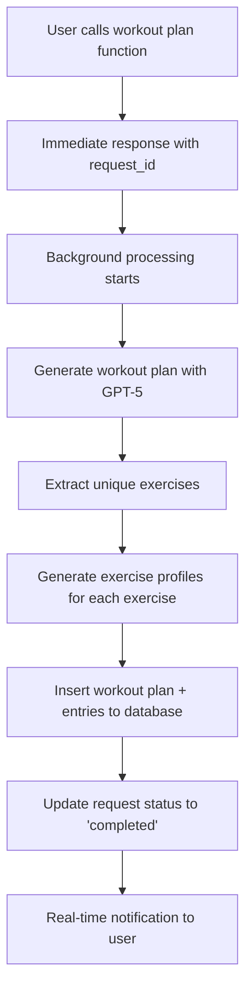

# Workout Plan Background Generation Integration Guide

## Overview

This guide explains how to integrate the background workout plan generation system into your React Native app. The system consists of two Supabase Edge Functions that work together to generate workout plans and exercise profiles asynchronously, with real-time notifications when complete.

## Architecture Overview



### System Components

1. **Supabase Edge Functions**:
   - `generate-workout-plan`: Main function that orchestrates the entire process
   - `generate-exercise-profile`: Creates detailed exercise profiles in the database

2. **Database Tables**:
   - `workout_plan_requests`: Tracks the status of background processing
   - `workout_plans`: Stores the generated workout plans
   - `workout_entries`: Contains all 8 weeks of workout data
   - `exercises`: Exercise profiles with detailed instructions

3. **Real-time Updates**: Using your existing RTK Query + Supabase Realtime setup

## Implementation Steps

### Step 1: Add Database Schema

Run the following SQL in your Supabase dashboard:

```sql
-- Copy and run the contents of workout_plan_requests.sql
```

This creates the tracking table that monitors background processing status.

### Step 2: Add GraphQL Schema & Code Generation

Add these queries to your GraphQL schema for code generation:

```graphql
# Query to get workout plan requests for real-time monitoring
query GetWorkoutPlanRequests($userId: UUID!) {
  workout_plan_requestsCollection(
    filter: { user_id: { eq: $userId } }
    orderBy: [{ created_at: desc }]
    first: 10
  ) {
    edges {
      node {
        id
        request_id
        status
        workout_plan_id
        error_message
        created_at
        completed_at
      }
    }
  }
}

# Query to get the completed workout plan
query GetWorkoutPlan($id: UUID!) {
  workout_plansCollection(filter: { id: { eq: $id } }) {
    edges {
      node {
        id
        summary
        start_date
        status
        created_at
        workout_entriesCollection(orderBy: [{ week_number: asc }, { day: asc }]) {
          edges {
            node {
              id
              week_number
              day_name
              day
              date
              sets
              reps
              weight
              time
              equipment
              notes
              exercise {
                name
                instructions
                required_equipment
              }
              streak_exercise: streakExercise {
                name
                instructions
              }
            }
          }
        }
      }
    }
  }
}
```

Run your GraphQL code generation to create the hooks.

### Step 3: Enhance Your Real-time API

Add to your `enhancedApi.ts`:

```typescript
export const enhancedApi = generatedApi.enhanceEndpoints({
  endpoints: {
    // ... existing endpoints

    // Add real-time monitoring for workout plan requests
    GetWorkoutPlanRequests: {
      providesTags: (result) => [
        'WorkoutPlanRequest',
        ...(result?.workout_plan_requestsCollection?.edges?.map(({ node }: any) => ({
          type: 'WorkoutPlanRequest' as const,
          id: node.id
        })) || [])
      ],
      async onCacheEntryAdded(
        arg,
        { updateCachedData, cacheDataLoaded, cacheEntryRemoved }
      ) {
        try {
          await cacheDataLoaded

          const { unsubscribe } = realtimeClient.subscribe({
            endpoint: 'workout_plan_requests',
            filter: `user_id=eq.${arg.userId}`,
            onUpdate: (payload) => {
              console.log('📡 Workout plan request update:', payload)

              updateCachedData((draft) => {
                if (!draft?.workout_plan_requestsCollection?.edges) return

                const { eventType, new: newRecord, old: oldRecord } = payload

                switch (eventType) {
                  case 'INSERT':
                    if (newRecord) {
                      const newRequest = { node: newRecord }
                      draft.workout_plan_requestsCollection.edges.unshift(newRequest)
                    }
                    break

                  case 'UPDATE':
                    if (newRecord) {
                      const requestIndex = draft.workout_plan_requestsCollection.edges.findIndex(
                        (edge: any) => edge.node.id === newRecord.id
                      )
                      if (requestIndex !== -1) {
                        draft.workout_plan_requestsCollection.edges[requestIndex].node = newRecord

                        // Show notification when completed
                        if (newRecord.status === 'completed') {
                          showWorkoutPlanCompletedNotification()
                        } else if (newRecord.status === 'failed') {
                          showWorkoutPlanFailedNotification(newRecord.error_message)
                        }
                      }
                    }
                    break
                }
              })
            },
            onError: (error) => {
              console.error('❌ Workout plan request subscription error:', error)
            }
          })

          await cacheEntryRemoved
          unsubscribe()

        } catch (error) {
          console.error('❌ Error in workout plan request subscription:', error)
        }
      }
    }
  }
})
```

### Step 4: Create Workout Plan Service

Create `services/workoutPlanService.ts`:

```typescript
import { supabase } from '../lib/supabase'

export interface WorkoutPlanGenerationRequest {
  userProfile: string // The user's fitness profile/preferences
}

export interface WorkoutPlanGenerationResponse {
  request_id: string
  status: 'processing'
  message: string
}

/**
 * Calls the background workout plan generation function
 * Returns immediately with a request_id for tracking
 */
export async function generateWorkoutPlan(
  request: WorkoutPlanGenerationRequest
): Promise<WorkoutPlanGenerationResponse> {
  const { data: { session } } = await supabase.auth.getSession()

  if (!session) {
    throw new Error('User must be authenticated to generate workout plan')
  }

  const response = await fetch(`${process.env.EXPO_PUBLIC_SUPABASE_URL}/functions/v1/generate-workout-plan`, {
    method: 'POST',
    headers: {
      'Authorization': `Bearer ${session.access_token}`,
      'Content-Type': 'application/json',
    },
    body: JSON.stringify(request)
  })

  if (!response.ok) {
    const errorData = await response.json().catch(() => ({}))
    throw new Error(errorData.error || `HTTP ${response.status}: ${response.statusText}`)
  }

  return await response.json()
}

/**
 * Show notification when workout plan is completed
 */
export function showWorkoutPlanCompletedNotification() {
  // Implement your notification logic here
  // Could be: Alert, Toast, Navigation, etc.
  console.log('🎉 Workout plan generation completed!')

  // Example implementations:
  // Alert.alert('Success!', 'Your workout plan is ready!')
  // showToast('Workout plan generated successfully!')
  // navigation.navigate('WorkoutPlan')
}

/**
 * Show notification when workout plan generation fails
 */
export function showWorkoutPlanFailedNotification(errorMessage?: string) {
  console.error('❌ Workout plan generation failed:', errorMessage)

  // Alert.alert('Error', errorMessage || 'Failed to generate workout plan')
}
```

### Step 5: Create Workout Plan Generation Hook

Create `hooks/useWorkoutPlanGeneration.ts`:

```typescript
import { useState } from 'react'
import { useGetWorkoutPlanRequestsQuery } from '../store/api/enhancedApi'
import { generateWorkoutPlan, WorkoutPlanGenerationRequest } from '../services/workoutPlanService'

export function useWorkoutPlanGeneration(userId: string) {
  const [isGenerating, setIsGenerating] = useState(false)
  const [currentRequestId, setCurrentRequestId] = useState<string | null>(null)

  // Monitor workout plan requests with real-time updates
  const { data: requestsData, isLoading } = useGetWorkoutPlanRequestsQuery({ userId })

  const requests = requestsData?.workout_plan_requestsCollection?.edges?.map(edge => edge.node) || []
  const latestRequest = requests[0]
  const currentRequest = currentRequestId ? requests.find(r => r.request_id === currentRequestId) : latestRequest

  const startGeneration = async (userProfile: string) => {
    try {
      setIsGenerating(true)

      const response = await generateWorkoutPlan({ userProfile })
      setCurrentRequestId(response.request_id)

      console.log('🚀 Workout plan generation started:', response.request_id)
      return response

    } catch (error) {
      console.error('❌ Failed to start workout plan generation:', error)
      setIsGenerating(false)
      throw error
    }
  }

  // Update isGenerating based on current request status
  if (currentRequest && isGenerating) {
    if (currentRequest.status === 'completed' || currentRequest.status === 'failed') {
      setIsGenerating(false)
    }
  }

  return {
    // State
    isGenerating,
    currentRequest,
    allRequests: requests,
    isLoading,

    // Actions
    startGeneration,

    // Computed
    isCompleted: currentRequest?.status === 'completed',
    isFailed: currentRequest?.status === 'failed',
    workoutPlanId: currentRequest?.workout_plan_id,
    errorMessage: currentRequest?.error_message,
  }
}
```

### Step 6: Implement in Your Component

Example usage in a component:

```typescript
import React, { useState, useEffect } from 'react'
import { View, Alert } from 'react-native'
import { Button, Text, TextInput } from 'react-native-paper'
import { useWorkoutPlanGeneration } from '../hooks/useWorkoutPlanGeneration'
import { useGetWorkoutPlanQuery } from '../store/api/enhancedApi'

export default function WorkoutPlanGeneratorScreen() {
  const [userProfile, setUserProfile] = useState('')
  const userId = 'current-user-id' // Get from auth context

  const {
    isGenerating,
    currentRequest,
    startGeneration,
    isCompleted,
    isFailed,
    workoutPlanId,
    errorMessage
  } = useWorkoutPlanGeneration(userId)

  // Fetch the completed workout plan when ready
  const { data: workoutPlanData } = useGetWorkoutPlanQuery(
    { id: workoutPlanId! },
    { skip: !workoutPlanId }
  )

  const handleGenerateWorkoutPlan = async () => {
    if (!userProfile.trim()) {
      Alert.alert('Error', 'Please enter your fitness profile')
      return
    }

    try {
      await startGeneration(userProfile)
      Alert.alert('Success', 'Workout plan generation started! You will be notified when complete.')
    } catch (error) {
      Alert.alert('Error', error.message)
    }
  }

  // Show success when completed
  useEffect(() => {
    if (isCompleted && workoutPlanData) {
      Alert.alert(
        'Workout Plan Ready! 🎉',
        'Your personalized workout plan has been generated.',
        [{ text: 'View Plan', onPress: () => {/* Navigate to workout plan */} }]
      )
    }
  }, [isCompleted, workoutPlanData])

  // Show error when failed
  useEffect(() => {
    if (isFailed) {
      Alert.alert('Generation Failed', errorMessage || 'Unknown error occurred')
    }
  }, [isFailed, errorMessage])

  return (
    <View style={{ padding: 20 }}>
      <Text variant="headlineMedium">Generate Workout Plan</Text>

      <TextInput
        label="Fitness Profile"
        value={userProfile}
        onChangeText={setUserProfile}
        multiline
        numberOfLines={4}
        placeholder="Describe your fitness goals, experience level, available equipment, etc."
        style={{ marginVertical: 16 }}
      />

      <Button
        mode="contained"
        onPress={handleGenerateWorkoutPlan}
        loading={isGenerating}
        disabled={isGenerating || !userProfile.trim()}
      >
        {isGenerating ? 'Generating...' : 'Generate Workout Plan'}
      </Button>

      {currentRequest && (
        <View style={{ marginTop: 20 }}>
          <Text variant="titleMedium">Status: {currentRequest.status}</Text>
          {currentRequest.status === 'processing' && (
            <Text>⏳ Generating your personalized workout plan...</Text>
          )}
          {currentRequest.status === 'completed' && (
            <Text>✅ Workout plan completed!</Text>
          )}
          {currentRequest.status === 'failed' && (
            <Text>❌ Generation failed: {errorMessage}</Text>
          )}
        </View>
      )}
    </View>
  )
}
```

## Error Handling

The system includes comprehensive error handling:

1. **Validation errors**: Missing user profile, authentication issues
2. **Generation errors**: OpenAI API failures, parsing errors
3. **Database errors**: Insertion failures, constraint violations
4. **Network errors**: Function timeout, connectivity issues

All errors are captured in the `workout_plan_requests.error_message` field and propagated through real-time updates.

## Testing

### Manual Testing Steps

1. **Deploy functions**: Ensure both Edge Functions are deployed
2. **Test authentication**: Verify user can call the function
3. **Monitor logs**: Watch Supabase Edge Function logs during generation
4. **Check database**: Verify data is inserted correctly
5. **Test notifications**: Ensure real-time updates work

### Example Test Data

```typescript
const testUserProfile = `
I'm a 25-year-old beginner looking to build muscle and lose weight.
I have access to a gym with all standard equipment.
I can work out 4 times per week for about 60 minutes each session.
My goal is to build lean muscle while losing 10 pounds.
I have no injuries or limitations.
`;
```

## Performance Considerations

- **Background Processing**: The function returns immediately (~200ms) while processing continues in background
- **Parallel Exercise Generation**: Exercise profiles are generated sequentially to avoid rate limits
- **Caching**: Exercise profiles are cached - duplicate exercises reuse existing profiles
- **Database Optimization**: Proper indexes ensure fast queries even with large datasets

## Troubleshooting

### Common Issues

1. **Function timeout**: Reduce the number of exercises or optimize prompts
2. **Authentication errors**: Ensure user session is valid and has proper permissions
3. **Real-time not working**: Check Supabase Realtime settings and table publications
4. **Database errors**: Verify all referenced tables exist and have proper schemas

### Debug Logs

The system includes comprehensive logging. Check:
- Supabase Edge Function logs
- React Native console for real-time updates
- Network tab for API calls

---

## Summary

This system provides a robust, scalable solution for generating workout plans with:
- ✅ Immediate user feedback with request tracking
- ✅ Background processing to prevent timeouts
- ✅ Real-time notifications when complete
- ✅ Comprehensive error handling
- ✅ Efficient caching of exercise profiles
- ✅ Full 8-week workout plan generation

The integration leverages your existing real-time infrastructure and follows established patterns in your codebase.