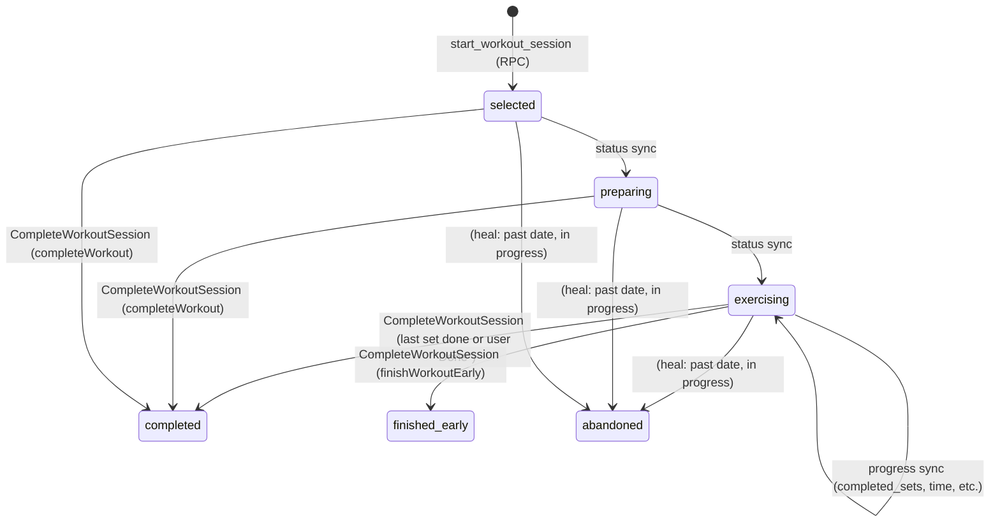

# Workout status flow

This document describes the possible **Redux** and **database** workout/session statuses and how they relate. Use it to reason about “what can happen” when a user starts, pauses, completes, or leaves a workout.

---

## 1. Redux statuses (in-app)

Lived in `store/slices/workoutSlice.ts` as `state.workout.status`.

| Status | Meaning |
|--------|--------|
| `inactive` | No workout loaded; home/list view. |
| `selected` | Workout selected; can be on warmup screen or before first exercise. |
| `preparing` | Before a set (confirm ready, then start set). |
| `exercising` | Set in progress (timer running or paused). |
| `set-complete` | Set just finished; about to start rest. |
| `resting` | Rest timer running (between sets). |
| `rest-ending` | Rest almost over; “ready for next set?”. |
| `exercise-transition` | Between exercises (after last set of current exercise). |
| `workout-completed` | All exercises/sets done; summary then clear. |

**Terminal Redux statuses:** After completion or early finish, Redux is reset to `inactive` (session/activeWorkout cleared). So the only “end” state you see briefly is `workout-completed` before reset.

---

## 2. Database session statuses (`workout_sessions.status`)

Stored in the DB and synced from Redux by `workoutListenerMiddleware.ts`.

| Status | Meaning | When it’s set |
|--------|--------|----------------|
| `selected` | Session created / warmup or pre-exercise. | When Redux is `selected`. |
| `preparing` | Between sets or before first set. | When Redux is `preparing` or `exercise-transition`. |
| `exercising` | Set or rest in progress. | When Redux is `exercising`, `set-complete`, `resting`, or `rest-ending`. |
| `paused` | User left mid-workout via “Save for later”; session is **resumable**. | `UpdateWorkoutSessionStatus` from `saveWorkoutForLater` thunk (progress synced, then status set to `paused`, Redux cleared). |
| `completed` | Workout fully finished. | `CompleteWorkoutSession` when Redux goes to `workout-completed` or user taps “Done”. |
| `finished_early` | User chose “Finish workout” (end and view summary); session is **not** resumable. | `CompleteWorkoutSession` from `finishWorkoutEarly` listener. |
| `abandoned` | Left in the middle (e.g. app closed); can be set by a “heal” only when workout date is before today (older than 24h of that day). | Not set by normal flow; used when cleaning up stale sessions. |

**Terminal DB statuses:** `completed`, `finished_early`, `abandoned`. Once set, the session is no longer “in progress”. **Resumable:** `selected`, `preparing`, `exercising`, `paused` (e.g. “Save for later”).

---

## 3. Redux → DB mapping (status sync)

Only **non-terminal** Redux statuses are synced to the DB (middleware skips `workout-completed` and `inactive`):

| Redux status | DB status |
|--------------|-----------|
| `selected` | `selected` |
| `preparing` | `preparing` |
| `exercise-transition` | `preparing` |
| `exercising` | `exercising` |
| `set-complete` | `exercising` |
| `resting` | `exercising` |
| `rest-ending` | `exercising` |
| `inactive` | *(not synced)* |
| `workout-completed` | *(handled by completion listeners → `completed` or `finished_early`)* |

So in the DB, “in progress” sessions usually sit in **`selected`**, **`preparing`**, or **`exercising`**.

---

## 4. Redux state flow (simplified)

```mermaid
stateDiagram-v2
  [*] --> inactive
  inactive --> selected : selectWorkout / loadWorkoutFromSession

  selected --> selected : confirmReadyAndStartSet (warmup)
  selected --> preparing : completeSet (warmup done)

  preparing --> exercising : confirmReadyAndStartSet (start set)
  exercising --> set-complete : completeSet
  set-complete --> resting : startRest (middleware)

  resting --> rest-ending : triggerRestEnding (timer / manual)
  rest-ending --> exercising : confirmReadyAndStartSet (next set)
  rest-ending --> exercise-transition : completeExercise (last set of exercise)

  exercising --> exercise-transition : completeExercise (last set of exercise)
  exercise-transition --> preparing : confirmReadyAndStartSet (next exercise)

  exercising --> workout-completed : completeExercise (last set of last exercise)
  rest-ending --> workout-completed : completeExercise (last set of last exercise)
  exercise-transition --> workout-completed : completeExercise (skip to end)

  workout-completed --> inactive : (middleware + navigation clear state)
  exercising --> inactive : completeWorkout (user "Done")
  resting --> inactive : completeWorkout
  preparing --> inactive : completeWorkout
  selected --> inactive : completeWorkout

  exercising --> inactive : finishWorkoutEarly
  resting --> inactive : finishWorkoutEarly
  preparing --> inactive : finishWorkoutEarly

  selected --> inactive : cleanup
  preparing --> inactive : cleanup
```

---

## 5. DB session lifecycle (when things get written)



- **completed** and **finished_early** are set only via `CompleteWorkoutSession` (with `completed_at`, `completed_sets`, etc.).
- **abandoned** is for “heal” logic: when we see a session that is still `selected` / `preparing` / `exercising` (or `paused`) and the workout **date is before today** (older than 24 hours of that day), we can set `abandoned` so the session is terminal and the UI shows partial progress instead of “In progress”.

---

## 6. What can happen if the app is closed mid-workout

If the user closes the app (or crashes) **without** going through “last set → workout-completed → CompleteWorkoutSession”:

- **Redux** is gone (in memory).
- **DB** keeps the last synced status. That is usually one of:
  - `selected` (e.g. on warmup or before first set)
  - `preparing` (between sets/exercises)
  - `exercising` (during set or rest; this is the most common “stuck” state)

So we can see sessions “stuck” in **`selected`**, **`preparing`**, or **`exercising`** with no `completed_at`.

Possible cases:

| Scenario | DB state | Heal / UI behavior |
|----------|----------|---------------------|
| Did all sets, then closed before “workout-completed” ran | `exercising`, `completed_sets == total_sets` | Heal: call `CompleteWorkoutSession` → `completed`. Card shows completed; can open workout-completed. |
| Did 2/4 exercises, then closed | `exercising` (or `preparing`), `completed_sets < total_sets` | Heal: set status to `abandoned`. Card shows partial progress (e.g. “Almost there”), not “In progress”. |
| Opened workout, never started a set | `selected` | Heal (optional): set to `abandoned` for past dates so it’s not “In progress” forever. |

**Rule:** Heal (complete or abandon) only when the workout **date is before today** — older than 24 hours of the day it was supposed to be done. Never heal today's session; it might still be in progress.

---

## 7. Quick reference

- **Redux terminal:** `workout-completed` (then cleared to `inactive`).
- **DB terminal:** `completed`, `finished_early`, `abandoned`.
- **“In progress” in DB:** `selected`, `preparing`, `exercising` (and `paused` if ever used).
- **Stale sessions:** Workout date **before today** (older than 24h of that day) + in-progress DB status → heal to `completed` (if all sets done) or `abandoned` (otherwise). Never heal today's session.
